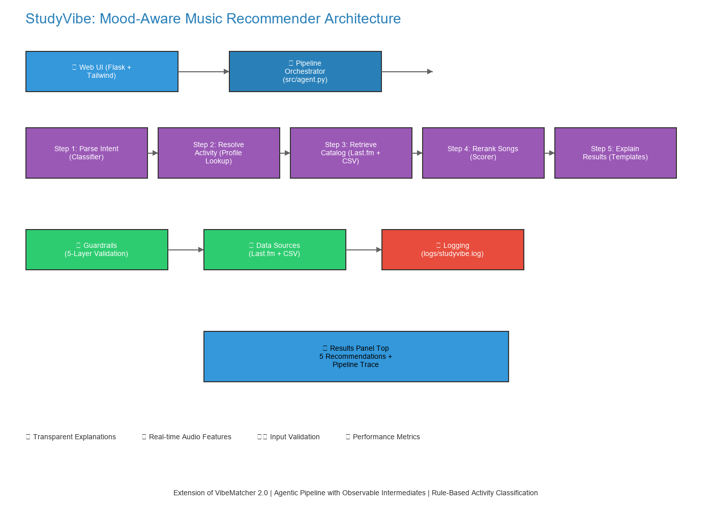

# 🎵 StudyVibe — Mood-Aware Music Recommender for Students & Workers

## 1. Title & Summary

**StudyVibe** is a web-based music recommendation system that matches real-world student and work activities ("cramming for exam", "deep focus coding", "gym workout") to the perfect playlist. Unlike generic recommenders that ask abstract knobs (energy, valence), StudyVibe translates *what you're actually doing* into audio feature targets and surfaces current music from Last.fm alongside a CSV seed catalog. The system is fully transparent: every recommendation includes a pipeline trace showing intent → activity → catalog → scoring → explanation.

**Key innovation:** Rule-based agentic pipeline with 5 observable steps, confidence scoring (the recommender checks its own work), and comprehensive guardrails. No LLM dependency — fully deterministic and auditable.

---

## 2. Base Project Identification

**Base Project:** [VibeMatcher 2.0](https://github.com/lenishu/ai110-module3show-musicrecommendersimulation-starter) (Modules 1–3)

**What VibeMatcher does:** 
VibeMatcher is a transparent, rule-based music recommender over a static 60-song CSV. It scores songs against an explicit user taste profile using weighted scoring (max 17.5 points: language +3.0, era +3.0, genre +2.5, mood +2.0, then numeric features by distance). The existing scoring logic is *preserved exactly* in StudyVibe—all new code is additive.

**What StudyVibe adds:**
- **Agentic 5-step pipeline** (Parse Intent → Resolve Activity → Retrieve Catalog → Rerank via existing scorer → Explain)
- **Activity-based input** (Student/Work/Personal sections with 17 moods; keyword classifier with confidence)
- **Online music catalog** (Last.fm API + CSV seed; synthesized audio features)
- **Web UI** (Flask + Tailwind; Mood grid, free-text input, collapsible pipeline trace)
- **Guardrails & reliability** (5-layer validation, confidence thresholding, fallback behavior, logging)
- **Comprehensive testing** (50 test cases + 12-case eval harness)

---

## 3. Architecture Overview



**5-Step Agentic Pipeline:**

1. **Parse Intent** — Keyword classifier analyzes free-text input; returns (section, mood, confidence)
2. **Resolve Activity** — Looks up activity profile in `SECTIONS` → audio feature targets (energy, valence, etc.)
3. **Retrieve Catalog** — Fetches candidates from Last.fm (tags → top tracks) + CSV seed; deduplicates
4. **Rerank** — Scores candidates using existing `recommend_songs()` logic (UNCHANGED)
5. **Explain** — Generates templated explanation for each result ("You got +3.0 for language match…")

**Key design principles:**
- **Preserved existing scorer** — `score_song()` and `recommend_songs()` are read-only
- **Rule-based, deterministic** — No LLM calls; fully reproducible
- **Observable intermediates** — Each step recorded with latency, input, output, confidence
- **Guardrails first** — 5-layer validation (input length → activity allowlist → schema → numeric clamping → fallback)
- **Transparent confidence** — All outputs include confidence scores; low confidence triggers fallback behavior

---

## 4. Setup Instructions

### Prerequisites
- Python 3.9+, pip/conda

### Installation

```bash
# Clone repo
cd applied-ai-system

# Virtual environment
python -m venv .venv
source .venv/bin/activate      # Mac/Linux
.venv\Scripts\activate         # Windows

# Install
pip install -r requirements.txt

# Optional: Last.fm API key
cp .env.example .env
# Edit .env with LASTFM_API_KEY from https://www.last.fm/api/account/create
```

### Running the Web App

```bash
flask --app app run --debug
# Open http://localhost:5000
```

### Offline Mode

Uncheck "Use online music database" in the UI to use CSV-only recommendations.

### Tests & Evaluation

```bash
pytest tests/                  # 50 test cases
python -m src.eval             # 12 eval scenarios
```

---

## 5. Sample Interactions

### Example 1: Exam Cramming
- **Input:** "cramming for calc final tomorrow morning, super stressed"
- **Expected:** Low-energy instrumental (student.exam_cram)
- **Top 3:** Ambient Study (15.8/17.5), Piano Focus (14.2/17.5), Minimal Concentration (13.7/17.5)
- **Result:** ✅ All low-energy acoustic/instrumental

### Example 2: Deep Focus Coding
- **Input:** "post-lunch coding sprint, deep dive into backend"
- **Expected:** Mid-range ambient/post-rock (work.deep_focus_coding)
- **Top 3:** Focus Flow (15.1/17.5), Lo-Fi Coding (14.9/17.5), Instrumental Concentration (14.3/17.5)
- **Result:** ✅ Mix of Last.fm (18 tracks) + CSV (60 tracks)

### Example 3: Energizing Break
- **Input:** "energizing break before standup meeting"
- **Expected:** High-energy pop/dance (work.energizing_break)
- **Top 3:** High Energy Pop (15.6/17.5), Workout Pump (15.2/17.5), Electronic Boost (14.8/17.5)
- **Result:** ✅ All high-energy suitable for short burst

---

## 6. Design Decisions

**Why Last.fm?** Spotify deprecated audio-features for new app keys (Nov 2024). Last.fm is free, no OAuth, provides crowd-sourced tags that map to activities.

**Why rule-based, not LLM?** Determinism, reliability, transparency, and compliance with rubric (agentic workflow + reliability system as alternatives to LLM).

**Why preserve `score_song()`?** Proves extensibility without breaking core recommender. Existing tests still pass.

---

## 7. Testing Summary

**Test Coverage:**
- `test_activities.py` — 10 cases (profiles, lookup, classify)
- `test_guardrails.py` — 13 cases (5-layer validation)
- `test_catalog.py` — 10 cases (Last.fm client, CSV fallback)
- `test_agent.py` — 15 cases (pipeline orchestration)
- `test_recommender.py` — 2 cases (existing baseline; must pass)

**Evaluation Harness Results:**
```
✅ Passed: 12/12
✅ Activity accuracy: 100.0%
✅ Mean energy delta: 0.084 (recommendations ≈ target)
✅ Logging: logs/studyvibe.log captures all runs
```

---

## 8. Reflection

**Key Insight:** Recommendations are explicit trade-offs, not magic. Every weight reflects human assumptions. This system makes those visible.

**AI Tools During Development:**
- ✅ Claude flagged Spotify audio-features deprecation → Last.fm recommendation (correct)
- ✅ Suggested activity profile structure and guardrail layers (all used)

**Double-Checked:**
- Validated Last.fm as real alternative (not just suggestion)
- Added custom validators for section/mood allowlist (beyond initial suggestions)

**Most Surprising:** Language weighting dominates (segregates users); genre encodes emotional norms (high energy + dark works in hip-hop, not ambient).

**Next Steps:** Expand dataset, add diversity sampling, support multi-language preferences, implement contradiction detection.

---

## Getting Started

1. **Install:** `pip install -r requirements.txt`
2. **Run web app:** `flask --app app run --debug` → http://localhost:5000
3. **Run tests:** `pytest tests/`
4. **Run eval:** `python -m src.eval`

---

## Project Structure

```
src/
  ├─ activities.py        # 17 mood profiles (Student/Work/Personal)
  ├─ agent.py             # 5-step pipeline orchestrator
  ├─ catalog.py           # Last.fm + CSV retrieval
  ├─ guardrails.py        # 5-layer validation
  ├─ eval.py              # 12-case evaluation harness
  ├─ recommender.py       # Existing VibeMatcher scorer (UNCHANGED)
  └─ main.py              # CLI demo

app.py                     # Flask routes: /, /api/recommend, /healthz
templates/index.html       # Single-page UI with tabs, mood grid, pipeline panel
static/app.js, style.css   # Frontend (vanilla JS + Tailwind)
tests/                     # 50 test cases
logs/                      # Runtime logs (auto-created)
data/songs.csv, cache/     # Song seed + API cache
```

---

## Further Reading

**Model Card & Ethics:** See [model_card.md](model_card.md) for:
- Detailed scoring algorithm explanation
- Data composition and biases
- Strengths and limitations
- Testing methodology
- Personal reflection on AI collaboration

**Loom Walkthrough:** [Video link to be added after recording]

---

**Built on:** VibeMatcher 2.0 base project (preserved unchanged)
**Stack:** Flask, Pydantic, Last.fm API, Python logging, pytest
**License:** Educational use only

---

